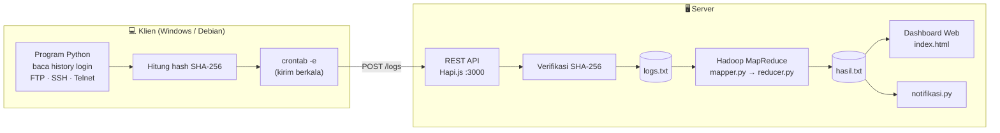

<div align="center">

# 🛡️ Sistem Logging Terdistribusi

### untuk Deteksi Serangan Jaringan

**Sistem pencatatan log terdistribusi berbasis REST API, Hadoop MapReduce, dan integritas data SHA-256 — untuk mendeteksi percobaan login mencurigakan (FTP/SSH/Telnet) di lingkungan jaringan perusahaan.**

[](https://hapi.dev)
[](https://hadoop.apache.org)
[](https://www.python.org)
[](https://en.wikipedia.org/wiki/SHA-2)
[](LICENSE)

</div>

---

## 📑 Daftar Isi

- [Tentang Proyek](#-tentang-proyek)
- [Fitur Utama](#-fitur-utama)
- [Alur Sistem](#-alur-sistem)
- [Hasil](#-hasil)
- [Teknologi](#-teknologi)
- [Struktur Repositori](#-struktur-repositori)
- [Cara Menjalankan](#-cara-menjalankan)
- [Referensi API](#-referensi-api)
- [Keputusan Desain](#-keputusan-desain)
- [Keterbatasan yang Diketahui](#-keterbatasan-yang-diketahui)
- [Tim](#-tim)

---

## 📖 Tentang Proyek

Setiap PC/laptop di lingkungan perusahaan menjalankan program Python yang mencatat riwayat login pada layanan **FTP, SSH, dan Telnet**, lalu mengirimkannya ke server melalui **REST API**. Setiap payload ditandatangani dengan **SHA-256** di sisi klien dan diverifikasi ulang di sisi server, sehingga log yang dimodifikasi di tengah jalan akan ditolak.

Log yang lolos verifikasi disimpan di server, kemudian diproses secara **terdistribusi** menggunakan **Hadoop MapReduce** untuk mengagregasi jumlah login gagal dan berhasil. Hasil agregasi ditampilkan pada **dashboard web** lokal di server, lengkap dengan notifikasi peringatan bila terdeteksi indikasi serangan.

> **Tujuan:** menyediakan visibilitas terpusat terhadap aktivitas login di banyak mesin, dengan jaminan bahwa data log tidak dapat diubah tanpa terdeteksi.

---

## ✨ Fitur Utama

- **Integritas log dengan SHA-256** — setiap log ditandatangani di klien dan diverifikasi ulang di server; payload yang dimodifikasi ditolak dengan HTTP 403.
- **Agen klien lintas platform** — membaca `/var/log/auth.log` di Linux (pola `sshd`, `vsftpd`, `proftpd`) dan Security Event Log di Windows (4625/4624) via `wevtutil`. Hanya butuh Python 3, tanpa `pip install`.
- **Anti-duplikat & store-and-forward** — posisi baca disimpan di state file, sehingga `cron` tidak mengirim ulang log yang sama; bila server mati, event diantrekan dan dikirim otomatis saat server pulih.
- **Pemrosesan terdistribusi** — Hadoop Streaming (mapper/reducer Python) mengagregasi `failed_login` / `successful_login`.
- **Dashboard pemantauan** — timeline serangan, top sumber penyerang, statistik log, dan activity log; seluruh angkanya dihitung dari data nyata dan disegarkan tiap 15 detik.
- **Notifikasi otomatis** — `notifikasi.py` memberi peringatan saat ambang login gagal terlampaui.
- **Teruji end-to-end** — diuji dengan simulasi dua pola trafik (pengguna sah + dua penyerang brute force) selama 5 menit; lihat [Hasil](#-hasil).

---

## 🏗️ Alur Sistem



**Penjelasan alur:**

1. **Klien** — program Python mencatat history login, menghitung hash SHA-256 dari `source|message|timestamp`, lalu mengirimnya ke server. Pengiriman dijadwalkan otomatis lewat `crontab -e`.
2. **REST API** — server Hapi.js menerima `POST /logs`, menghitung ulang hash, dan membandingkannya. Jika tidak cocok → **HTTP 403** (data dianggap dimodifikasi). Jika valid → disimpan ke `logs.txt`.
3. **MapReduce** — job Hadoop Streaming membaca `logs.txt`, `mapper.py` mengklasifikasikan setiap log menjadi `failed_login` / `successful_login`, lalu `reducer.py` menjumlahkannya. Output disimpan ke `hasil.txt`.
4. **Monitoring** — dashboard web membaca `hasil.txt` (agregat MapReduce) dan `logs.txt` (log mentah), lalu menghitung seluruh metriknya sendiri; `notifikasi.py` mencetak peringatan bila ambang batas terlampaui.

---

## 🖼️ Hasil


Seluruh angka pada dashboard dihitung dari data nyata — `failed_login` / `successful_login` dari
`hasil.txt`, sedangkan timeline, top sumber serangan, dan statistik log dihitung langsung dari
`logs.txt`. Tidak ada nilai statis atau tiruan.

| Tangkapan layar | Isi |
| :--- | :--- |
| `docs/screenshots/dashboard.png` | Dashboard monitoring (data contoh otentik) |
| `docs/screenshots/dashboard-simulasi.png` | Dashboard saat **uji simulasi 5 menit** — lihat di bawah |
| `docs/screenshots/screenshot-1.png` | Tampilan dashboard saat pengujian tim |
| `docs/screenshots/screenshot-2.png` | Respons `GET /logs` dari REST API |
| `docs/screenshots/screenshot-3.png` | Output MapReduce di HDFS (`part-00000`) |

### Uji simulasi 5 menit

Sistem pernah diuji dengan dua pola trafik yang dijalankan bersamaan selama 5 menit:

| Aktor | Pola |
| :--- | :--- |
| Pengguna sah (`sirpann`) | Login berhasil tiap ~18 s, sesekali gagal karena salah password |
| Penyerang `203.0.113.45` | Brute force `root` — burst 4–7 percobaan gagal tiap ~45 s |
| Penyerang `198.51.100.23` | Brute force `admin` — burst 2–4 percobaan gagal tiap ~65 s |

**Hasil:** 82 log masuk (65 gagal, 17 berhasil — rasio 79 %), threat level **CRITICAL**.
Rantai data terverifikasi utuh: 82 baris di `logs.txt` = 82 dari `GET /logs` = 65 + 17 di
`hasil.txt`, dengan antrean klien tersisa 0 (tidak ada log hilang maupun ganda).

> Uji ini juga memunculkan satu temuan: panel *Ringkasan Deteksi* (dari `hasil.txt`) dan
> *Statistik Log* (dari `logs.txt`) sempat saling bertentangan karena `hasil.txt` baru diperbarui
> ketika job MapReduce dijalankan. Detailnya ada di bagian [Keterbatasan](#-keterbatasan-yang-diketahui).

---

## 🧰 Teknologi

| Lapisan | Teknologi |
| :--- | :--- |
| REST API | **Node.js** + **Hapi.js** (`@hapi/hapi`) |
| ID unik log | **nanoid** |
| Integritas data | **SHA-256** (`crypto` bawaan Node.js) |
| Penyimpanan log | File **JSON Lines** (`logs.txt`) |
| Pemrosesan terdistribusi | **Hadoop Streaming** (MapReduce) |
| Bahasa pemrosesan | **Python 3** (`mapper.py`, `reducer.py`, `notifikasi.py`) |
| Antarmuka monitoring | **HTML + CSS + JavaScript** (vanilla, tanpa framework) |
| Penjadwalan | **cron** (`crontab -e`) di sisi klien & server |

---

## 📂 Struktur Repositori

```
sistem-logging-terdistribusi/
├── client/
│   └── client_logger.py          # Agen klien: baca log login → hash SHA-256 → POST /logs
├── src/                          # Kode utama
│   ├── server.js                 # REST API (Hapi.js, port 3000)
│   ├── index.html                # Dashboard monitoring
│   ├── style.css                 # Styling dashboard
│   ├── mapper.py                 # Map: klasifikasi jenis login
│   ├── reducer.py                # Reduce: agregasi jumlah per jenis
│   ├── notifikasi.py             # Peringatan berdasarkan hasil agregasi
│   ├── run_mapreduce.sh          # Upload ke HDFS + jalankan job Hadoop
│   ├── package.json              # Dependensi Node.js
│   ├── package-lock.json
│   ├── logs.txt                  # Contoh data log (JSON Lines)
│   └── hasil.txt                 # Contoh output MapReduce
├── docs/
│   ├── deskripsi-singkat.docx    # Deskripsi & alur proyek
│   ├── langkah-pengerjaan-server.docx
│   ├── laporan-proyek.pdf        # Laporan lengkap
│   ├── laporan-presentasi.pdf    # Laporan presentasi
│   ├── presentasi-sistem-logging.pptx
│   ├── topologi-sistem.png       # Diagram topologi
│   └── screenshots/              # Tangkapan layar dashboard & hasil pengujian
├── media/
│   └── demo-sistem-logging.mp4   # Video demo
├── drafts/                       # Histori pengembangan (21 iterasi UI + dashboard lama)
└── release/
    └── PROJECT-sistem-logging.zip   # Paket submission final
```

> **Catatan:** `logs.txt` dan `hasil.txt` sengaja diletakkan di dalam `src/` karena `server.js`
> menulis ke `logs.txt` dan `index.html` membaca `hasil.txt` melalui path **relatif**. Memindahkannya
> ke folder lain akan memutus alur program tanpa perubahan kode.

---

## 🚀 Cara Menjalankan

### Prasyarat

- **Node.js** & **npm**
- **Python 3**
- **Hadoop** (untuk menjalankan MapReduce) — opsional bila hanya ingin mencoba REST API & dashboard

### 1. Jalankan REST API

```bash
cd src
npm install          # memasang @hapi/hapi dan nanoid
node server.js       # server berjalan di http://localhost:3000
```

### 2. Jalankan Log Collector Client

Jalankan di setiap PC yang ingin dipantau. Klien hanya butuh **Python 3** (tanpa `pip install`).

```bash
# Uji coba dulu tanpa mengirim apa pun
python3 client/client_logger.py --dry-run

# Kirim log baru ke server
LOG_SERVER_URL=http://<IP-SERVER>:3000/logs \
CLIENT_SOURCE=client-debian \
AUTH_LOG=/var/log/auth.log \
python3 client/client_logger.py
```

Agar berjalan otomatis, daftarkan di `crontab -e`:

```cron
* * * * * /usr/bin/python3 /opt/sistem-logging/client/client_logger.py >> /var/log/log-client.log 2>&1
```

**Cara kerja klien:**

| Tahap | Detail |
| :--- | :--- |
| Baca log | Linux: `/var/log/auth.log` (pola `sshd` & `vsftpd`). Windows: Security Event Log (4625 gagal / 4624 berhasil) via `wevtutil`. |
| Susun pesan | `Log: Failed login attempt via SSH from <ip>` · `Log: Successful login attempt on Windows` |
| Tandatangani | `hash = SHA-256(source\|message\|timestamp)` — diverifikasi ulang oleh server. |
| Kirim | `POST /logs` dengan payload JSON. |
| Anti-duplikat | Offset baca disimpan di `.client_state.json`, sehingga cron tidak mengirim ulang log yang sama. |
| Store-and-forward | Bila server mati, event disimpan di antrean dalam state file dan dikirim saat server kembali hidup — **log tidak hilang**. |

> **Alternatif manual** — mengirim satu log lewat `curl`:
>
> ```bash
> # Hash = SHA-256 dari "source|message|timestamp"
> curl -X POST http://localhost:3000/logs \
>   -H "Content-Type: application/json" \
>   -d '{"source":"client-windows","message":"Failed login attempt on Windows","timestamp":"2025-06-12T17:14:00","hash":"<sha256>"}'
> ```

### 3. Jalankan MapReduce

```bash
cd src
bash run_mapreduce.sh      # upload logs.txt ke HDFS, jalankan job, simpan ke hasil.txt
```

> Sesuaikan path `hadoop-streaming-*.jar` di dalam `run_mapreduce.sh` dengan lokasi Hadoop di mesin Anda.

### 4. Jalankan notifikasi

```bash
cd src
python3 notifikasi.py      # membaca hasil.txt dan mencetak peringatan
```

### 5. Buka dashboard

Buka `src/index.html` melalui web server lokal (bukan `file://`), misalnya:

```bash
cd src
python3 -m http.server 8080
# lalu akses http://localhost:8080
```

Dashboard membaca `hasil.txt` dan `logs.txt` dari folder yang sama melalui `fetch()`, lalu menghitung
seluruh metriknya di sisi klien dan menyegarkan tampilan setiap 15 detik. Karena itu ia **harus**
diakses lewat web server — membuka berkasnya langsung dengan `file://` akan memblokir `fetch()`.

---

## 🔌 Referensi API

| Method | Endpoint | Body | Respons |
| :--- | :--- | :--- | :--- |
| `POST` | `/logs` | `source`, `message`, `timestamp`, `hash` | `201` sukses · `400` data tidak lengkap · `403` hash tidak valid |
| `GET` | `/logs` | — | `200` array seluruh log dari `logs.txt` |

**Skema verifikasi integritas:**

```
dataString = `${source}|${message}|${timestamp}`
serverHash = SHA256(dataString)
valid      = (serverHash === hash)
```

---

## 🧠 Keputusan Desain

| # | Keputusan | Alasan | Trade-off yang diterima |
| :-- | :--- | :--- | :--- |
| 1 | **Hash SHA-256 di klien, diverifikasi ulang di server** | Deteksi modifikasi log saat transit tanpa perlu PKI/TLS yang kompleks. | Menjamin *integritas*, bukan *kerahasiaan* — isi log masih terbaca di jaringan. |
| 2 | **Hapi.js sebagai framework REST API** | Validasi payload bawaan, struktur route yang jelas, ringan. | Menambah satu dependensi; alternatif `http` bawaan Node.js lebih minimal. |
| 3 | **Log disimpan sebagai file JSON Lines (`logs.txt`)** | Mudah diaudit manusia, mudah dibaca MapReduce baris-per-baris, tanpa server database. | Tidak ada indeks/query; tidak cocok untuk volume sangat besar atau akses konkuren tinggi. |
| 4 | **Hadoop Streaming dengan Python** | Tim sudah familier Python; tidak perlu menulis Java. | Overhead startup JVM per job; berlebihan untuk data kecil. |
| 5 | **Penjadwalan via `cron`** | Tersedia di semua distro Linux, tanpa daemon tambahan. | Tidak ada retry/observability bawaan bila job gagal. |
| 6 | **Dashboard membaca `hasil.txt` langsung** | Menghilangkan kebutuhan menyajikan API agregasi tambahan. | Dashboard harus di-serve lewat web server; tidak bisa dibuka via `file://`. |

---

## ⚠️ Keterbatasan yang Diketahui

1. **Kode klien asli tidak ditemukan — `client/client_logger.py` adalah hasil rekonstruksi.** Dokumen, presentasi, dan video proyek menjelaskan adanya program Python di tiap PC klien, tetapi **tidak ada satu pun berkas kode klien** di arsip proyek, laporan PDF, maupun video demo. Klien dalam repositori ini direkonstruksi dari bukti yang tersisa (respons `GET /logs`, contoh `logs.txt`, dan skema hash di `server.js`), lalu diuji end-to-end terhadap server asli. Format pesan dan skema hash dibuat identik dengan data historis, namun implementasi aslinya bisa berbeda detail.
2. **`run_mapreduce.sh` memuat path absolut** (`/home/sirpann/Downloads/hadoop/...`). Skrip harus disunting sebelum dijalankan di mesin lain.
3. **Tidak ada autentikasi pada REST API.** Siapa pun yang menjangkau port 3000 dapat mengirim log (asal hash-nya benar) atau membaca seluruh log lewat `GET /logs`.
4. **`logs.txt` tumbuh tanpa rotasi.** Belum ada pemangkasan atau pengarsipan otomatis, sehingga file akan terus membesar.
5. **Ringkasan Deteksi (dari `hasil.txt`) dan Statistik Log (dari `logs.txt`) bisa tidak sinkron.** `hasil.txt` hanya diperbarui saat job MapReduce dijalankan, sedangkan `logs.txt` bertambah real-time. Saat uji demo 5 menit, dashboard sempat menampilkan *Ringkasan Deteksi* "9 log" (dari `hasil.txt` yang basi) berdampingan dengan *Statistik Log* "82 entri" (dari `logs.txt` yang live) — dua panel saling bertentangan sampai MapReduce dijalankan ulang. Solusi jangka panjangnya adalah menjadwalkan MapReduce lewat `cron` dan menampilkan waktu pembaruan `hasil.txt` secara eksplisit.
6. **Ambang notifikasi masih statis.** `notifikasi.py` memakai aturan tetap (1 gagal = peringatan, 3+ gagal = alarm) tanpa mempertimbangkan jendela waktu atau basis normal (baseline), sehingga rentan false positive.
7. **`drafts/` berisi 21 iterasi UI** yang disimpan sebagai histori pengembangan — bukan kode yang dipakai. Versi aktif adalah `src/index.html`. Termasuk di dalamnya `index-asli-final.html` dan `dashboard-lama.png`, yaitu versi dashboard sebelum dirombak agar seluruh panelnya memakai data nyata.
8. **Ada ketidaksesuaian antara dokumentasi dan implementasi.** Presentasi menyebut endpoint `/receive-logs` (implementasi: `/logs`) dan notifikasi ">10 gagal login dalam 1 menit" (implementasi: ambang statis 1 dan 3, tanpa jendela waktu). Dokumen asli dibiarkan apa adanya sebagai arsip; README ini mengikuti implementasi.
9. **Dashboard menghitung metriknya di sisi klien.** Ia membaca `hasil.txt` dan `logs.txt` langsung sebagai berkas, bukan lewat endpoint API. Konsekuensinya dashboard harus di-serve melalui web server dan berada satu folder dengan kedua berkas tersebut.

---

## 👥 Tim

| Nama | NIM |
| :--- | :--- |
| Achmed Nazriel L. | 2423600003 |
| Syafan Aditya I. | 2423600004 |

**Praktikum Sistem Terdistribusi**

---

<div align="center"><sub>Dokumentasi lengkap tersedia di <code>docs/</code> · Demo video di <code>media/</code></sub></div>
