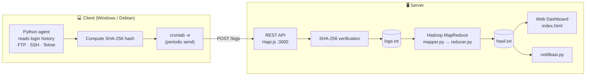
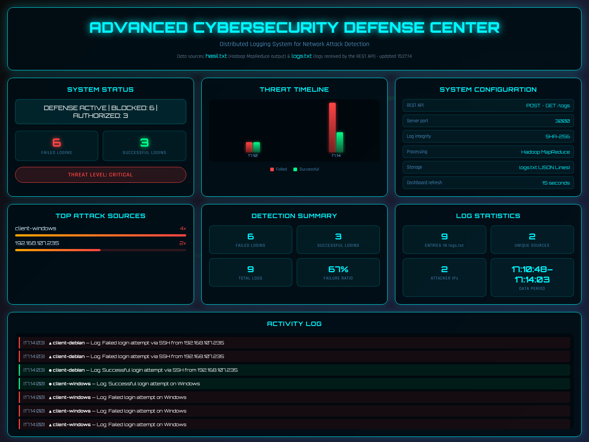

<div align="center">

# 🛡️ Distributed Logging System

### for Network Attack Detection

**A distributed log collection and analysis system built on a Hapi.js REST API, SHA-256 integrity verification, and Hadoop MapReduce — detecting suspicious FTP / SSH / Telnet login attempts across an enterprise network.**

[](https://hapi.dev)
[](https://hadoop.apache.org)
[](https://www.python.org)
[](https://en.wikipedia.org/wiki/SHA-2)
[](LICENSE)

</div>

---

## 📑 Table of Contents

- [About](#-about)
- [Key Features](#-key-features)
- [System Flow](#-system-flow)
- [Results](#-results)
- [Tech Stack](#-tech-stack)
- [Repository Structure](#-repository-structure)
- [Getting Started](#-getting-started)
- [API Reference](#-api-reference)
- [Design Decisions](#-design-decisions)
- [Known Limitations](#-known-limitations)
- [Authors](#-authors)

---

## 📖 About

Every PC/laptop in the enterprise runs a **Python agent** that records login history for **FTP, SSH, and Telnet** services and ships it to a central server over a **REST API**. Each payload is signed with **SHA-256** on the client and re-verified on the server, so any log tampered with in transit is rejected outright.

Verified logs are persisted on the server and then processed in a **distributed** fashion using **Hadoop MapReduce** to aggregate failed and successful login counts. The aggregated results are presented on a local **web dashboard**, complete with alert notifications when attack indicators appear.

> **Goal:** provide centralised visibility into login activity across many machines, with a guarantee that log data cannot be altered undetected.

> 📐 **Deep dive:** see **[docs/ARCHITECTURE.md](docs/ARCHITECTURE.md)** for the full component breakdown, data model, sequence diagrams, integrity-verification flow, failure-mode analysis, and security considerations.

---

## ✨ Key Features

- **SHA-256 log integrity** — every log is signed on the client and re-verified on the server; tampered payloads are rejected with `HTTP 403`.
- **Cross-platform client agent** — reads `/var/log/auth.log` on Linux (`sshd`, `vsftpd`, `proftpd` patterns) and the Windows Security Event Log (4625/4624) via `wevtutil`. Requires only Python 3, no `pip install`.
- **Deduplication & store-and-forward** — the read offset is persisted in a state file so `cron` never re-sends the same log; if the server is down, events are queued and flushed automatically once it recovers.
- **Distributed processing** — Hadoop Streaming (Python mapper/reducer) aggregates `failed_login` / `successful_login` counts.
- **Monitoring dashboard** — attack timeline, top attack sources, log statistics, and a live activity log; every figure is computed from real data and refreshed every 15 seconds.
- **Automatic alerting** — `notifikasi.py` raises a warning once the failed-login threshold is crossed.
- **Verified end-to-end** — tested with a 5-minute simulation of two traffic patterns (a legitimate user plus two brute-force attackers); see [Results](#-results).

---

## 🏗️ System Flow



**How it works:**

1. **Client** — a Python agent reads login history, computes the SHA-256 hash of `source|message|timestamp`, and posts it to the server. Sending is scheduled automatically via `crontab -e`.
2. **REST API** — the Hapi.js server receives `POST /logs`, recomputes the hash, and compares it. On mismatch → **HTTP 403** (the data is treated as tampered). On match → the entry is appended to `logs.txt`.
3. **MapReduce** — a Hadoop Streaming job reads `logs.txt`; `mapper.py` classifies each line as `failed_login` / `successful_login` and `reducer.py` sums them. The output is written to `hasil.txt`.
4. **Monitoring** — the web dashboard reads `hasil.txt` (MapReduce aggregate) and `logs.txt` (raw logs) and derives all of its metrics client-side; `notifikasi.py` prints an alert when the threshold is exceeded.

---

## 🖼️ Results



Every figure on the dashboard is derived from real data — `failed_login` / `successful_login` come from
`hasil.txt`, while the timeline, top attack sources, and log statistics are computed directly from
`logs.txt`. There are no static or placeholder values.

| Screenshot | Contents |
| :--- | :--- |
| `docs/screenshots/dashboard.png` | Monitoring dashboard (authentic sample data) |
| `docs/screenshots/dashboard-simulasi.png` | Dashboard during the **5-minute simulation run** — see below |
| `docs/screenshots/screenshot-1.png` | Dashboard view captured by the team during testing |
| `docs/screenshots/screenshot-2.png` | `GET /logs` response from the REST API |
| `docs/screenshots/screenshot-3.png` | MapReduce output in HDFS (`part-00000`) |

### 5-minute simulation run

The system was exercised with two concurrent traffic patterns over 5 minutes:

| Actor | Pattern |
| :--- | :--- |
| Legitimate user (`sirpann`) | Successful login every ~18 s, occasionally failing on a mistyped password |
| Attacker `203.0.113.45` | Brute force against `root` — bursts of 4–7 failed attempts every ~45 s |
| Attacker `198.51.100.23` | Brute force against `admin` — bursts of 2–4 failed attempts every ~65 s |

**Result:** 82 logs ingested (65 failed, 17 successful — a 79 % failure ratio), threat level **CRITICAL**.
The data chain was verified end to end: 82 lines in `logs.txt` = 82 from `GET /logs` = 65 + 17 in
`hasil.txt`, with 0 items left in the client queue (nothing lost, nothing duplicated).

> This run also surfaced one finding: the *Detection Summary* panel (from `hasil.txt`) and the
> *Log Statistics* panel (from `logs.txt`) briefly disagreed, because `hasil.txt` is only refreshed
> when the MapReduce job runs. See [Known Limitations](#-known-limitations) for details.

---

## 🧰 Tech Stack

| Layer | Technology |
| :--- | :--- |
| REST API | **Node.js** + **Hapi.js** (`@hapi/hapi`) |
| Log ID generation | **nanoid** |
| Data integrity | **SHA-256** (Node.js built-in `crypto`) |
| Log storage | **JSON Lines** file (`logs.txt`) |
| Distributed processing | **Hadoop Streaming** (MapReduce) |
| Processing language | **Python 3** (`mapper.py`, `reducer.py`, `notifikasi.py`, `client_logger.py`) |
| Monitoring UI | **HTML + CSS + JavaScript** (vanilla, no framework) |
| Scheduling | **cron** (`crontab -e`) on both client and server |

---

## 📂 Repository Structure

```
sistem-logging-terdistribusi/
├── client/
│   └── client_logger.py          # Client agent: read login logs → SHA-256 → POST /logs
├── src/                          # Core application
│   ├── server.js                 # REST API (Hapi.js, port 3000)
│   ├── index.html                # Monitoring dashboard
│   ├── style.css                 # Dashboard styling
│   ├── mapper.py                 # Map: classify login type
│   ├── reducer.py                # Reduce: aggregate counts per type
│   ├── notifikasi.py             # Alerting based on the aggregate
│   ├── run_mapreduce.sh          # Upload to HDFS + run the Hadoop job
│   ├── package.json              # Node.js dependencies
│   ├── package-lock.json
│   ├── logs.txt                  # Sample log data (JSON Lines)
│   └── hasil.txt                 # Sample MapReduce output
├── docs/
│   ├── ARCHITECTURE.md           # Architecture deep dive
│   ├── deskripsi-singkat.docx    # Project description & flow
│   ├── langkah-pengerjaan-server.docx
│   ├── laporan-proyek.pdf        # Full report
│   ├── laporan-presentasi.pdf    # Presentation report
│   ├── presentasi-sistem-logging.pptx
│   ├── topologi-sistem.png       # Topology diagram
│   └── screenshots/              # Dashboard & test-result screenshots
├── media/
│   └── demo-sistem-logging.mp4   # Demo video
├── drafts/                       # Development history (21 UI iterations + previous dashboard)
└── release/
    └── PROJECT-sistem-logging.zip   # Final submission package
```

> **Note:** `logs.txt` and `hasil.txt` intentionally live inside `src/` because `server.js` writes to
> `logs.txt` and `index.html` reads `hasil.txt` through **relative** paths. Moving them elsewhere
> would break the program without a code change.

---

## 🚀 Getting Started

### Prerequisites

- **Node.js** & **npm**
- **Python 3**
- **Hadoop** (for the MapReduce job) — optional if you only want to try the REST API and dashboard

### 1. Run the REST API

```bash
cd src
npm install          # installs @hapi/hapi and nanoid
node server.js       # server listens on http://localhost:3000
```

### 2. Run the Log Collector Client

Run this on every machine you want to monitor. The client needs only **Python 3** (no `pip install`).

```bash
# Dry run first — sends nothing
python3 client/client_logger.py --dry-run

# Send new logs to the server
LOG_SERVER_URL=http://<SERVER-IP>:3000/logs \
CLIENT_SOURCE=client-debian \
AUTH_LOG=/var/log/auth.log \
python3 client/client_logger.py
```

To run it automatically, register it in `crontab -e`:

```cron
* * * * * /usr/bin/python3 /opt/sistem-logging/client/client_logger.py >> /var/log/log-client.log 2>&1
```

**How the client works:**

| Stage | Detail |
| :--- | :--- |
| Read logs | Linux: `/var/log/auth.log` (`sshd` & `vsftpd` patterns). Windows: Security Event Log (4625 failed / 4624 successful) via `wevtutil`. |
| Build message | `Log: Failed login attempt via SSH from <ip>` · `Log: Successful login attempt on Windows` |
| Sign | `hash = SHA-256(source\|message\|timestamp)` — re-verified by the server. |
| Send | `POST /logs` with a JSON payload. |
| Deduplication | The read offset is stored in `.client_state.json`, so cron never re-sends the same log. |
| Store-and-forward | If the server is down, events are queued in the state file and sent once it is back up — **no log is lost**. |

> **Manual alternative** — send a single log with `curl`:
>
> ```bash
> # Hash = SHA-256 of "source|message|timestamp"
> curl -X POST http://localhost:3000/logs \
>   -H "Content-Type: application/json" \
>   -d '{"source":"client-windows","message":"Failed login attempt on Windows","timestamp":"2025-06-12T17:14:00","hash":"<sha256>"}'
> ```

### 3. Run MapReduce

```bash
cd src
bash run_mapreduce.sh      # upload logs.txt to HDFS, run the job, write hasil.txt
```

> Adjust the `hadoop-streaming-*.jar` path inside `run_mapreduce.sh` to match your Hadoop installation.

### 4. Run the notifier

```bash
cd src
python3 notifikasi.py      # reads hasil.txt and prints alerts
```

### 5. Open the dashboard

Serve `src/index.html` over a local web server (not `file://`), for example:

```bash
cd src
python3 -m http.server 8080
# then open http://localhost:8080
```

The dashboard reads `hasil.txt` and `logs.txt` from the same folder via `fetch()`, derives every metric
client-side, and refreshes every 15 seconds. It therefore **must** be served over HTTP — opening the
file directly with `file://` will make the browser block `fetch()`.

---

## 🔌 API Reference

| Method | Endpoint | Body | Response |
| :--- | :--- | :--- | :--- |
| `POST` | `/logs` | `source`, `message`, `timestamp`, `hash` | `201` success · `400` incomplete data · `403` invalid hash |
| `GET` | `/logs` | — | `200` array of every log in `logs.txt` |

**Integrity verification scheme:**

```
dataString = `${source}|${message}|${timestamp}`
serverHash = SHA256(dataString)
valid      = (serverHash === hash)
```

---

## 🧠 Design Decisions

| # | Decision | Rationale | Trade-off accepted |
| :-- | :--- | :--- | :--- |
| 1 | **SHA-256 hashed on the client, re-verified on the server** | Detects log tampering in transit without needing complex PKI/TLS. | Guarantees *integrity*, not *confidentiality* — log contents are still readable on the wire. |
| 2 | **Hapi.js as the REST API framework** | Built-in payload validation, clear route structure, lightweight. | Adds one dependency; Node's built-in `http` would be more minimal. |
| 3 | **Logs stored as a JSON Lines file (`logs.txt`)** | Easy for humans to audit, easy for MapReduce to read line by line, no database server needed. | No indexing or querying; unsuitable for very large volumes or high-concurrency access. |
| 4 | **Hadoop Streaming with Python** | The team was already fluent in Python; no Java needed. | JVM startup overhead per job; overkill for small datasets. |
| 5 | **Scheduling via `cron`** | Available on every Linux distribution, no extra daemon. | No built-in retry or observability when a job fails. |
| 6 | **Dashboard reads `hasil.txt` directly** | Removes the need to expose an additional aggregation API. | The dashboard must be served over a web server; it cannot be opened via `file://`. |
| 7 | **Client-side metric computation** | Keeps the server simple — no extra endpoints, no caching layer. | Every open dashboard re-parses both files; acceptable at this data volume. |
| 8 | **Client state file for offset + queue** | Makes cron runs idempotent and lets the agent survive server outages without losing data. | State is per-machine and must be excluded from version control. |

---

## ⚠️ Known Limitations

1. **The original client code was not found — `client/client_logger.py` is a reconstruction.** The project documents, presentation, and video all describe a Python program on each client PC, but **no client source file exists** in the project archive, the PDF reports, or the demo video. The client in this repository was reconstructed from the surviving evidence (the `GET /logs` response, the sample `logs.txt`, and the hashing scheme in `server.js`) and then tested end to end against the real server. The message format and hash scheme match the historical data, but the original implementation may differ in detail.
2. **`run_mapreduce.sh` contains absolute paths** (`/home/sirpann/Downloads/hadoop/...`). The script must be edited before running on another machine.
3. **The REST API has no authentication.** Anyone who can reach port 3000 can submit logs (as long as the hash is correct) or read every log via `GET /logs`.
4. **`logs.txt` grows without rotation.** There is no automatic pruning or archiving, so the file keeps growing.
5. **Detection Summary (from `hasil.txt`) and Log Statistics (from `logs.txt`) can disagree.** `hasil.txt` is only refreshed when the MapReduce job runs, while `logs.txt` grows in real time. During the 5-minute demo the dashboard briefly showed a *Detection Summary* of "9 logs" (from a stale `hasil.txt`) next to *Log Statistics* of "82 entries" (from live `logs.txt`) — two panels contradicting each other until MapReduce was re-run. The long-term fix is to schedule MapReduce via `cron` and show the `hasil.txt` refresh time explicitly.
6. **The notification threshold is static, and `failed == 2` is silent.** `notifikasi.py` branches on `failed == 1` and `elif failed >= 3`, with no time window or baseline. Exactly two failures satisfy neither condition, so they produce **no output at all** — a verified gap, not a theoretical one. It is also prone to false positives since it never compares against normal activity.
7. **`drafts/` holds 21 UI iterations** kept as development history — not the code in use. The active version is `src/index.html`. It also includes `index-asli-final.html` and `dashboard-lama.png`, i.e. the dashboard as it looked before every panel was rewired to use real data.
8. **Documentation and implementation disagree.** The presentation mentions a `/receive-logs` endpoint (implementation: `/logs`) and an alert rule of ">10 failed logins in 1 minute" (implementation: static thresholds of 1 and 3, with no time window). The original documents are left untouched as an archive; this README follows the implementation.
9. **The dashboard computes its metrics client-side.** It reads `hasil.txt` and `logs.txt` as files rather than through an API endpoint. Consequently it must be served over a web server and must sit in the same folder as both files.

---

## 👥 Authors

| Name | NIM |
| :--- | :--- |
| Achmed Nazriel L. | 2423600003 |
| Syafan Aditya I. | 2423600004 |

GitHub: [@irfansss-03](https://github.com/irfansss-03) · [@Nazriellesmono](https://github.com/Nazriellesmono)

**Distributed Systems Practicum**

---

<div align="center"><sub>Full documentation in <code>docs/</code> · Demo video in <code>media/</code></sub></div>
