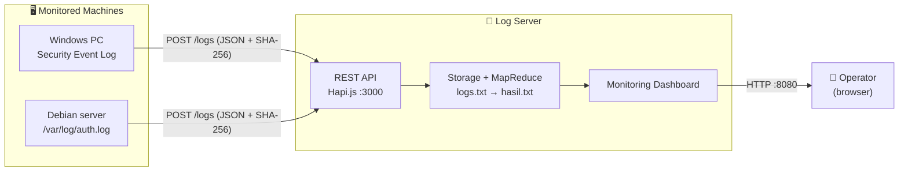
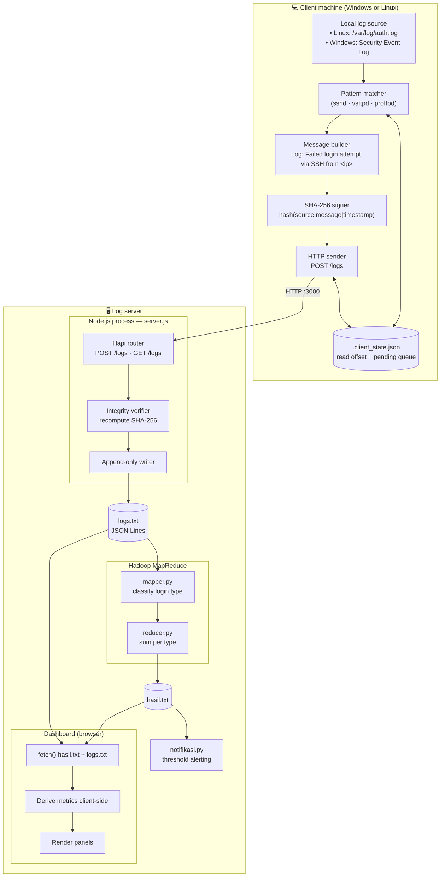
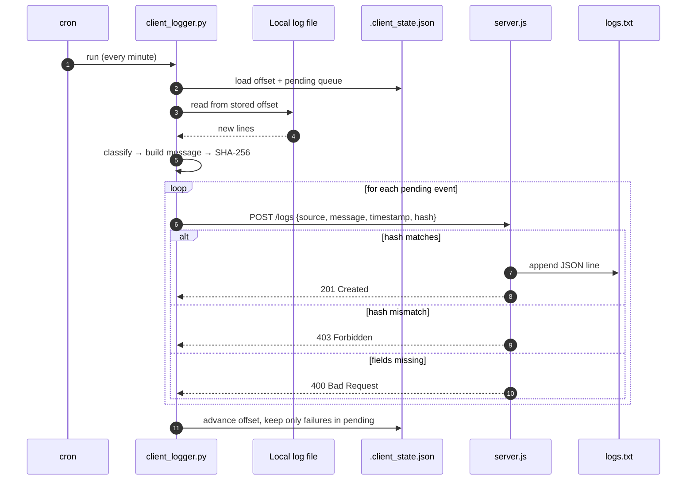
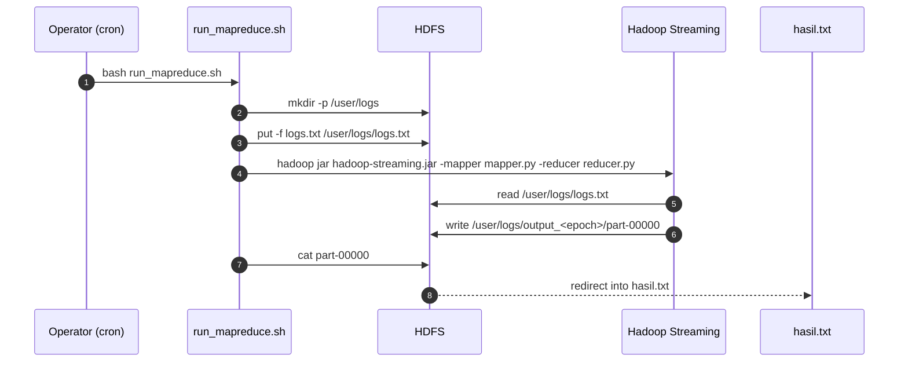
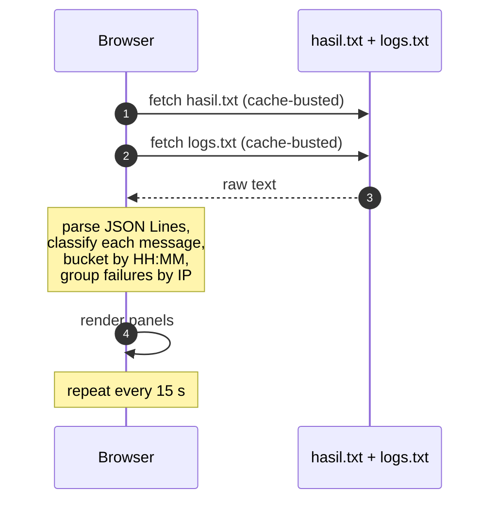
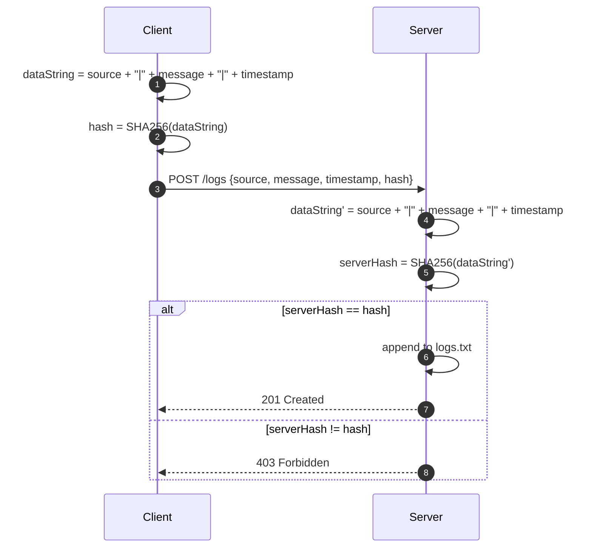
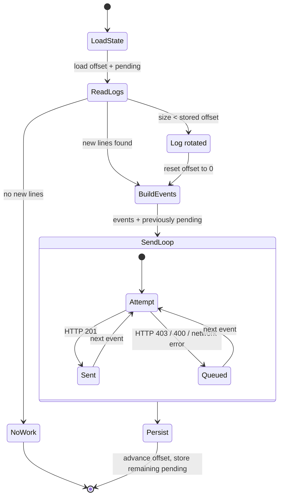

<div align="center">

# 📐 System Architecture

**Distributed Logging System for Network Attack Detection**

*How the client agents, REST API, integrity verification, MapReduce pipeline, and monitoring dashboard fit together.*

</div>

---

## Table of Contents

1. [Design Goals & Constraints](#1-design-goals--constraints)
2. [System Context](#2-system-context)
3. [Component Architecture](#3-component-architecture)
4. [Component Breakdown](#4-component-breakdown)
5. [Data Model](#5-data-model)
6. [Key Data Flows](#6-key-data-flows)
7. [Integrity Verification Flow](#7-integrity-verification-flow)
8. [Client State Machine](#8-client-state-machine)
9. [Failure Modes & Resilience](#9-failure-modes--resilience)
10. [Design Decisions](#10-design-decisions)
11. [Known Limitations & Trade-offs](#11-known-limitations--trade-offs)
12. [Security Considerations](#12-security-considerations)
13. [Deployment Topology](#13-deployment-topology)

---

## 1. Design Goals & Constraints

The system collects login activity from many machines and makes attacks visible in one place — without
the operational weight of a full SIEM stack.

| Constraint | Consequence on the design |
| :--- | :--- |
| **Many heterogeneous clients** | A single agent must run on both Windows and Linux with no third-party dependencies. It uses only the Python standard library. |
| **Logs are security evidence** | A log that can be silently altered is worthless. Every entry is hashed with SHA-256 on the client and re-verified on the server. |
| **Clients send on a schedule, not on demand** | Agents run from `cron`, so every run must be idempotent — the same log must never be counted twice. |
| **The server may be unavailable** | An agent must not lose events while the server is down. Un-sent events are queued locally and flushed on recovery. |
| **Analysis must scale beyond one machine** | Aggregation is delegated to Hadoop MapReduce rather than done in the API process. |
| **Operators need an at-a-glance view** | A browser dashboard shows attack volume, sources, and raw activity, refreshing itself automatically. |
| **Modest hardware** | The whole stack runs on a single Linux box; no database server, no message broker, no container platform. |

> **North-star requirement:** *a log entry either arrives intact, or it is visibly rejected — never silently corrupted.*

---

## 2. System Context

Three actors: the **monitored machines**, the **log server**, and the **human operator**.



| Actor | Responsibility |
| :--- | :--- |
| **Monitored machines** | Run the Python agent; read local login records; sign and ship them. |
| **Log server** | Verifies integrity, stores logs, aggregates them with MapReduce, and serves the dashboard. |
| **Operator** | Watches the dashboard for attack indicators. |

---

## 3. Component Architecture



**Reading the diagram**

- The **client** is a one-shot program. It is not a daemon: `cron` starts it, it reads whatever is new, sends it, persists its position, and exits.
- The **server** is a single Node.js process. It has no database — `logs.txt` *is* the store.
- **MapReduce is a separate, batch stage.** It is not triggered by the API; it reads the file that the API wrote.
- The **dashboard never talks to the API.** It reads the two files directly, which is why it must be served from the same directory.

---

## 4. Component Breakdown

### 4.1 Client Agent — `client/client_logger.py`

A single-file, dependency-free Python 3 program intended to be run from `cron`.

| Stage | Implementation |
| :--- | :--- |
| **Read** | Linux: tails `/var/log/auth.log` from a stored byte offset. Windows: queries the Security Event Log with `wevtutil qe Security /q:"*[System[(EventID=4625 or EventID=4624)]]" /f:xml`. |
| **Detect rotation** | If the file size is smaller than the stored offset (i.e. `logrotate` replaced it), the offset resets to 0. |
| **Classify** | Regex patterns map each line to `(status, protocol, ip)`: `Failed password … from <ip>` → failed/SSH, `Accepted password … from <ip>` → successful/SSH, `FAIL LOGIN: Client "<ip>"` → failed/FTP, `OK LOGIN: Client "<ip>"` → successful/FTP. |
| **Build message** | `Log: Failed login attempt via SSH from 192.168.107.235` or `Log: Successful login attempt on Windows`. The words `failed` / `successful` are the contract with `mapper.py`. |
| **Sign** | `hash = SHA-256(f"{source}|{message}|{timestamp}")` — byte-for-byte identical to the server's computation. |
| **Deduplicate** | The byte offset (Linux) or the highest `EventRecordID` (Windows) is persisted, so a re-run produces zero new events. |
| **Queue** | Un-sent events are held in a `pending` list inside the state file and retried on the next run. |
| **Dry run** | `--dry-run` prints the payloads without sending **and without advancing the state**, so it is non-destructive. |

### 4.2 REST API — `src/server.js`

A Hapi.js server listening on `0.0.0.0:3000` with two routes.

| Route | Behaviour |
| :--- | :--- |
| `POST /logs` | Validates that `source`, `message`, `hash`, and `timestamp` are all present (else `400`). Recomputes the SHA-256 hash (mismatch → `403`). Assigns a `nanoid()` id, appends the entry to `logs.txt`, and returns `201`. |
| `GET /logs` | Reads `logs.txt`, splits on newlines, `JSON.parse`es each line, and returns the array (`200`). Returns `500` if the file cannot be read. |

> **Implementation note:** `server.js` also declares an in-memory `const logs = []` and pushes each entry
> into it, but nothing ever reads that array — it is dead code left over from an earlier design. The file
> is the only real store.

### 4.3 MapReduce Stage

| Component | Role |
| :--- | :--- |
| `run_mapreduce.sh` | Creates `/user/logs` in HDFS, uploads `logs.txt`, runs the Hadoop Streaming job, then pulls `part-00000` back into `hasil.txt`. |
| `mapper.py` | Reads JSON lines from stdin; emits `failed_login\t1` when the lowercased message contains `failed`, `successful_login\t1` when it contains `successful`. Unparseable lines are skipped. |
| `reducer.py` | Sums the `\t`-separated key/value pairs and prints `key: value` for both categories. |

> **Ordering note:** the mapper emits `failed_login` / `successful_login` based on substring matching.
> `failed` is checked first, so a message containing both words would be classified as failed. The
> message builder avoids this by using exactly one of the two words.

### 4.4 Dashboard — `src/index.html` + `src/style.css`

A static page with no build step and no framework.

| Panel | Data source | Derived from |
| :--- | :--- | :--- |
| **System Status** | `hasil.txt` | `failed_login` / `successful_login` counts |
| **Threat Timeline** | `logs.txt` | Entries bucketed by `HH:MM`, split failed vs successful |
| **System Configuration** | static facts | Endpoint, port, hash algorithm, storage format |
| **Top Attack Sources** | `logs.txt` | Failed entries grouped by IP (extracted from the message) or by source name |
| **Detection Summary** | `hasil.txt` | Totals and failure ratio |
| **Log Statistics** | `logs.txt` | Entry count, unique sources, distinct attacker IPs, data period |
| **Activity Log** | `logs.txt` | Last 60 entries, newest first |

### 4.5 Notifier — `src/notifikasi.py`

Reads `hasil.txt` and prints a warning when the failed count crosses a threshold.

---

## 5. Data Model

There is no database. Three files carry the entire state.

### 5.1 `logs.txt` — append-only log store (JSON Lines)

One JSON object per line:

```json
{"id":"DnYwZPSU5dsnTJG_jF3Pd","source":"client-windows","message":"Log: Failed login attempt on Windows","timestamp":"2025-06-12T17:10:48.640595"}
```

| Field | Type | Meaning |
| :--- | :--- | :--- |
| `id` | string | `nanoid()` generated server-side; unique per stored entry. |
| `source` | string | Client identity, e.g. `client-debian`. |
| `message` | string | Human-readable description; must contain `failed` or `successful`. |
| `timestamp` | string | Client-side ISO 8601 local time, microsecond precision. |

> **Not stored:** the `hash`. It is verified on arrival and then discarded, so integrity can be proven at
> ingest time but **not re-proven later** from the stored file. See [§11](#11-known-limitations--trade-offs).

### 5.2 `hasil.txt` — MapReduce aggregate

```
failed_login: 6
successful_login: 3
```

### 5.3 `.client_state.json` — client position and queue

```json
{
  "offset::/var/log/auth.log": 4821,
  "windows_last_record": 0,
  "pending": [
    {"message": "Log: Failed login attempt via SSH from 203.0.113.45", "timestamp": "2026-10-02T14:36:14.051558"}
  ]
}
```

| Key | Meaning |
| :--- | :--- |
| `offset::<path>` | Byte offset already consumed for that log file. |
| `windows_last_record` | Highest `EventRecordID` already sent. |
| `pending` | Events captured but not yet accepted by the server. |

---

## 6. Key Data Flows

### 6.1 Log Ingestion (the hot path)



**Ordering guarantee:** the offset is written **after** the send attempts, and failed events stay in
`pending`. A crash mid-run therefore re-sends at worst one batch — it never skips a log.

### 6.2 Batch Aggregation (MapReduce)



The output path is suffixed with `date +%s`, so consecutive runs never collide.

### 6.3 Dashboard Refresh



---

## 7. Integrity Verification Flow

The single security-critical path in the system.



| Property | Assessment |
| :--- | :--- |
| **Detects modification in transit** | Yes — any change to `source`, `message`, or `timestamp` changes the hash. |
| **Detects truncation / reordering** | No — there is no sequence number or chain linking entries to each other. |
| **Provides confidentiality** | No — the payload is plaintext JSON. |
| **Protects against a malicious client** | No — the client computes its own hash, so a hostile client can sign anything. |
| **Verifiable after the fact** | No — the hash is not stored alongside the entry. |

> The scheme is a **tamper-evidence mechanism for honest clients on an untrusted network**, not a
> cryptographic guarantee against a compromised endpoint. See [§12](#12-security-considerations).

---

## 8. Client State Machine

The agent is a one-shot process, so "state" means what it persisted between runs.



| Outcome | Offset advanced? | Event kept in `pending`? |
| :--- | :--- | :--- |
| `201 Created` | yes | no |
| `403` invalid hash | yes | yes |
| `400` incomplete data | yes | yes |
| Connection refused | yes | yes |
| `--dry-run` | **no** | no (nothing sent) |

> **Why keep a `403` event in the queue?** A rejected event is re-sent on every subsequent run until it is
> accepted. That is deliberate — the alternative (dropping it) would lose evidence. The practical
> consequence is that a permanently-rejected event retries forever; see [§11](#11-known-limitations--trade-offs).

---

## 9. Failure Modes & Resilience

| Failure | System behaviour | Data loss? |
| :--- | :--- | :--- |
| **Server unreachable** | Events accumulate in the client's `pending` queue; the agent exits with status `1`. | **No** |
| **Server recovers** | The next cron run flushes the whole queue before reading new lines. | **No** |
| **Client crashes mid-send** | The offset was not yet advanced, so the batch is re-read next run. Possible duplicate. | **No** (may duplicate) |
| **Log rotation** | Detected by a shrinking file size; the offset resets and the file is re-read from the start. | **No** |
| **Corrupted line in `logs.txt`** | `GET /logs` throws and returns `500`; the dashboard's parser skips the malformed line and keeps rendering. | Partial (dashboard survives) |
| **`hasil.txt` missing** | The dashboard's `Detection Summary` stays empty; panels driven by `logs.txt` still render. | No |
| **MapReduce not yet run** | `hasil.txt` is stale, so *Detection Summary* disagrees with *Log Statistics*. | No (misleading) |
| **Malformed JSON to `POST /logs`** | Hapi rejects the request; nothing is written. | No |
| **Missing fields** | `400` returned; nothing is written. | No |
| **Duplicate delivery** | No deduplication on the server — duplicates are counted. | No (may double-count) |

---

## 10. Design Decisions

| # | Decision | Rationale | Trade-off accepted |
| :-- | :--- | :--- | :--- |
| 1 | **Hash on the client, verify on the server** | Tamper evidence without PKI or TLS infrastructure. | Integrity only — no confidentiality, no protection from a malicious client. |
| 2 | **Hapi.js over raw `http`** | Built-in payload parsing and validation; clear route definitions. | One dependency for a two-route API. |
| 3 | **Flat file instead of a database** | Auditable by a human, readable line-by-line by MapReduce, zero setup. | No indexes, no concurrent-write safety, no rotation. |
| 4 | **Hadoop Streaming with Python** | The team knew Python; avoids writing Java. | JVM startup per job; heavy for small data. |
| 5 | **`cron` as the scheduler** | Present everywhere, no daemon to run. | No retry policy, no job-level observability. |
| 6 | **One-shot agent rather than a daemon** | A crash cannot leave a stuck process; cron restarts it naturally. | Up to one interval of latency; process start-up cost per run. |
| 7 | **Offset-based deduplication in a state file** | Idempotent cron runs with no server-side coordination. | Per-machine state that must not be committed; loses position if deleted. |
| 8 | **Client-side queue for offline resilience** | The agent keeps evidence when the server is down. | State file grows unbounded if the outage is long. |
| 9 | **Dashboard reads files, not the API** | No extra endpoint, no caching layer, no CORS setup. | Must be served over HTTP from the same directory. |
| 10 | **Client-side metric derivation** | Keeps the server minimal and stateless. | Each open tab re-parses both files every 15 s. |

---

## 11. Known Limitations & Trade-offs

Documented honestly — each is a direct consequence of the decisions in §10.

1. **The `403` retry loop never terminates.** A rejected event stays in `pending` forever and is re-sent on every run. A corrupt or permanently-rejected entry therefore generates unbounded retries and log noise. A maximum retry count with dead-lettering would fix it.
2. **The hash is not stored.** `logs.txt` keeps only `id`, `source`, `message`, and `timestamp`. Integrity is provable *at ingest time* but cannot be re-verified later — so the file is not self-validating once written.
3. **No deduplication on the server.** If a client crashes after the server accepted a batch but before persisting its offset, the batch is re-sent and counted twice. This inflates the aggregate.
4. **`failed == 2` produces no notification.** `notifikasi.py` branches on `failed == 1` and `elif failed >= 3`, so exactly two failures fall through both conditions silently.
5. **`hasil.txt` is a batch artefact.** It only changes when the MapReduce job runs, so *Detection Summary* can contradict *Log Statistics* until then — observed live during the 5-minute demo (9 vs 82). Scheduling MapReduce via `cron` and displaying the `hasil.txt` modification time would resolve it.
6. **The dashboard re-parses everything on every refresh.** Both files are fetched and fully processed every 15 seconds per open tab. Fine at this scale; it would not be at millions of lines.
7. **`logs.txt` is never rotated.** The file grows without bound and is read in full by `GET /logs` on every call, so that endpoint degrades linearly with log volume.
8. **MapReduce output is not versioned.** `hasil.txt` is overwritten in place; there is no history of previous aggregates.
9. **`server.js` contains dead code.** An in-memory `logs` array is populated but never read.
10. **The client's message classifier is substring-based.** `mapper.py` matches on the literal strings `failed` / `successful`; any change to the message wording silently breaks aggregation.
11. **Only login events are collected.** The agent parses authentication lines only — file access, sudo, and service restarts are out of scope.
12. **The original client implementation was never recovered.** `client/client_logger.py` is a reconstruction from surviving evidence and may differ from the version the team actually ran.

---

## 12. Security Considerations

This is a security-monitoring project, so its own security posture deserves an explicit assessment.

| Aspect | Current state | Risk |
| :--- | :--- | :--- |
| **Transport** | Plain HTTP on port 3000. | Log contents and the API key surface are readable on the wire. |
| **Authentication** | None. | Anyone reaching port 3000 can submit logs or read the entire log store. |
| **Authorization** | None. | No separation between writers and readers. |
| **Integrity** | SHA-256 over `source\|message\|timestamp`, computed by the client. | Detects accidental or in-transit modification; does **not** stop a malicious client from signing forged entries. |
| **Replay** | No nonce, no timestamp window. | A captured payload can be replayed verbatim and will be accepted. |
| **Confidentiality** | None. | Failed-login logs leak usernames and source IPs. |
| **Input validation** | Presence checks on four fields. | No length limits, no rate limiting, no schema validation. |
| **Dashboard exposure** | Served by `python3 -m http.server`, typically bound to `0.0.0.0`. | The log store is downloadable by anyone on the network. |

**Highest-value hardening steps, in order:**

1. Bind both the API and the dashboard to a trusted interface, or place them behind a reverse proxy with TLS and authentication.
2. Add request authentication (a shared secret header or mTLS) and rate limiting on `POST /logs`.
3. Include a server-issued nonce or a narrow timestamp window to prevent replay.
4. Store the hash alongside each entry so integrity can be re-verified later.
5. Restrict `GET /logs` to authenticated operators.

---

## 13. Deployment Topology

```
┌───────────────────────────────────────────────────────────────┐
│  Monitored machines                                           │
│                                                               │
│  Linux client                       Windows client           │
│  ┌───────────────────────┐          ┌──────────────────────┐  │
│  │ client_logger.py      │          │ client_logger.py     │  │
│  │ reads /var/log/auth.log│         │ reads Security log   │  │
│  │ .client_state.json    │          │ .client_state.json   │  │
│  │ crontab: * * * * *    │          │ Task Scheduler       │  │
│  └───────────┬───────────┘          └──────────┬───────────┘  │
└──────────────┼──────────────────────────────────┼─────────────┘
               │  POST /logs (JSON + SHA-256)     │
               └──────────────────┬───────────────┘
                                  ▼
┌───────────────────────────────────────────────────────────────┐
│  Log server (single Linux host)                               │
│                                                               │
│  Node.js — server.js                                          │
│    • listens on 0.0.0.0:3000                                  │
│    • POST /logs → verify SHA-256 → append to logs.txt         │
│    • GET  /logs → return the full log array                   │
│                                                               │
│  Hadoop (local or pseudo-distributed)                         │
│    • run_mapreduce.sh → HDFS → mapper.py/reducer.py           │
│    • output pulled back into hasil.txt                        │
│                                                               │
│  Static web server (python3 -m http.server 8080)              │
│    • serves src/index.html + style.css                        │
│    • dashboard fetches hasil.txt and logs.txt                 │
│                                                               │
│  Files:  src/logs.txt · src/hasil.txt                         │
└───────────────────────────────────────────────────────────────┘
                                  ▲
                                  │  HTTP :8080
                            👤 Operator (browser)
```

**Port summary**

| Port | Protocol | Service |
| :--- | :--- | :--- |
| 3000 | HTTP | REST API (`POST /logs`, `GET /logs`) |
| 8080 | HTTP | Static dashboard (any web server) |
| 9870 | HTTP | HDFS NameNode web UI (Hadoop default) |

**Process model**

| Process | Lifetime | Started by |
| :--- | :--- | :--- |
| `client_logger.py` | One-shot per run | `cron` / Task Scheduler |
| `server.js` | Long-running | Operator (or a systemd unit) |
| `run_mapreduce.sh` | One-shot per batch | `cron` / operator |
| `notifikasi.py` | One-shot | `cron` / operator |
| Static web server | Long-running | Operator |

---

<div align="center"><sub>See <a href="../README.md">README.md</a> for setup and configuration.</sub></div>
